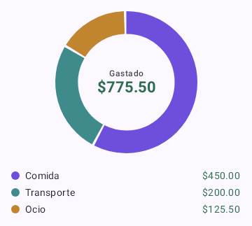
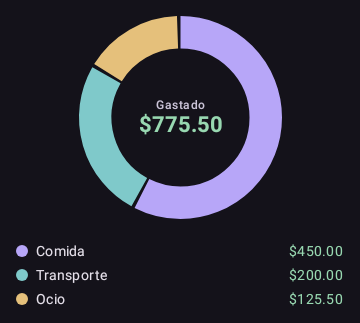
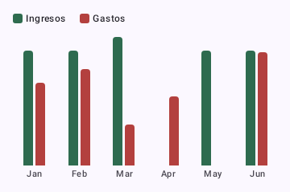
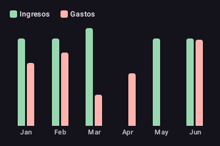

<div align="center">

# 💸 FinFlow

### Your finances, in your pocket. No cloud, no accounts, no excuses.

**Offline-first personal finance manager, encrypted at rest and with a home-screen widget.**


[](https://github.com/Hacybeyker/FinFlow/actions/workflows/ci.yml)
[](https://sonarcloud.io/summary/new_code?id=com.hacybeyker.finflow)
[](https://github.com/Hacybeyker/FinFlow/actions/workflows/ci.yml)


</div>

---

FinFlow tracks **income and expenses while working 100% offline**. You log transactions by category, see your balance and trends in charts drawn with Canvas, and check the month's summary from a **widget** without opening the app. The local database is the **single source of truth** —there's no backend— and, since it's about money, it's **encrypted at rest** and protected with **biometrics**.

## ✨ What sets it apart

| | |
|---|---|
| 🔒 **Real privacy** | Your finances **never leave the device**. Local DB encrypted with SQLCipher; the passphrase is generated and sealed with **Tink (AEAD) + Android Keystore**. |
| ⚡ **Always works** | _Offline-first_: zero loading screens, zero network errors. The UI reacts instantly thanks to Room + Flow. |
| 📊 **Clear picture** | Monthly balance, spending by category (donut) and month-over-month trend (bars), all in **Canvas** for a lightweight APK. |
| 🏠 **Present beyond the app** | A **Glance** widget and **WorkManager** reminders so you never forget to log an expense. |
| 📤 **Your data is yours** | One-tap **CSV export** via the Storage Access Framework — no storage permission, RFC 4180-escaped, spreadsheet-ready. |

> **In one sentence:** keep control of your money in a way that's **private, fast, and free of any internet or server dependency.**

## 🏛️ Architecture

**Vertical Slice Architecture (feature-first)**: each feature is a self-contained slice with its own `domain` / `data` / `ui` layers, so a change to *charts* never touches *transactions*. Inside every slice: **MVI** (one immutable `UiState` per screen), unidirectional data flow, and repository contracts owned by `domain`.

```
                        ┌───────────────────────────────┐
                        │  navigation  ·  Navigation 3  │
                        └───────────────┬───────────────┘
                                        │
  feature/* ─ one self-contained slice per feature ─────────────────────────┐
  │       transactions · charts · security · settings · widget · reminders │
  │                                                                        │
  │   ┌──────────────────────┐        ┌──────────────────────────────┐     │
  │   │ ui                   │ ─────▶ │ domain                       │     │
  │   │ Compose + MVI        │ intents│ use cases + contracts        │     │
  │   │ ViewModel            │ /state │ (pure Kotlin, no Android)    │     │
  │   └──────────────────────┘        └──────────────▲───────────────┘     │
  │                                                  │ implements          │
  │   ┌──────────────────────┐                       │                     │
  │   │ data                 │ ──────────────────────┘                     │
  │   │ repository impls     │                                             │
  │   └──────────┬───────────┘                                             │
  └──────────────┼──────────────────────────────────────────────────────── ┘
                 ▼
  ┌──────────────────────────────┐   ┌─────────────────────────────────────┐
  │ core/database                │   │ core/ui · core/domain · core/di     │
  │ Room + SQLCipher             │   │ theme & shared UI · cross-feature   │
  │ (Tink-sealed passphrase)     │   │ contracts · Hilt wiring             │
  └──────────────────────────────┘   └─────────────────────────────────────┘
```

## 🛠️ Stack

| Layer | Technologies |
|-------|--------------|
| **Language & UI** | Kotlin · Jetpack Compose (Material 3, brand palette — dynamic color deliberately off) · Navigation 3 · Canvas for charts (no charting libs) |
| **Architecture** | Vertical Slice (feature-first) with `domain` / `data` / `ui` per slice · **MVI** (one immutable state per screen) · Coroutines + Flow / StateFlow · Hilt |
| **Data & security** | Room (+ KSP) as the SSOT with `Flow` DAOs · SQLCipher · **Tink (AEAD) + Android Keystore** · `androidx.biometric` · DataStore |
| **System** | Jetpack Glance (widget) · WorkManager (reminders and deferred tasks) |
| **Quality & tests** | JUnit · Turbine · coroutines-test · hand-rolled fakes · **Robolectric** (UI flows on the JVM) · **Roborazzi** (screenshot goldens) · **Kover** (≥95% coverage gate) · ktlint · detekt · Android Lint · SonarCloud · Gradle Build Scans |

## 🧪 Quality gates

Every push to `main` runs the full pipeline — and **fails** if any gate breaks:

1. **Static analysis** — ktlint + detekt + Android Lint (`codeQuality`).
2. **Tests** — unit + Robolectric UI flows (93 tests, one JVM run shared by all gates).
3. **Coverage gate** — Kover fails the build under **95%** line coverage on measured classes (domain, data, ViewModels; codegen and framework adapters excluded by design).
4. **Screenshot gate** — Roborazzi diffs the charts against committed goldens; a single changed pixel without re-recording fails CI.
5. **SonarCloud** — Quality Gate blocks the job (`sonar.qualitygate.wait`), with a Build Scan published per run for diagnostics.

The goldens guarding the charts (light/dark, versioned in `app/src/test/screenshots/`):

<div align="center">

&nbsp;

&nbsp;

</div>

## 🧭 Key decisions

| Decision | Why |
|----------|-----|
| **No backend, ever** | Privacy as a feature: financial data never leaves the device, so there is nothing to breach remotely. |
| **SQLCipher + Tink-sealed passphrase** | Encryption at rest for the whole DB; the passphrase is random, AEAD-encrypted and never stored in plaintext. |
| **Canvas charts, no libraries** | Two charts don't justify a dependency; custom drawing keeps the APK lean and the visuals on-brand. |
| **Robolectric over emulator for UI flows** | Seconds instead of minutes per run, same CI, and Roborazzi reuses the whole setup for screenshot tests. |
| **R8 enabled on AGP 9.x** | Release builds are shrunk and obfuscated using the new `optimization` DSL + `keepRules` source folder. |
| **GitHub Actions pinned to SHA** | Mutable tags (`@v6`) are a supply-chain vector; commits are immutable. Dependabot keeps the pins fresh. |

## ⚡ Commands

> **Requirements:** JDK 17 (build; bytecode targets Java 11) · Android Studio with AGP `9.3` · `compileSdk 37` · `targetSdk 36` · `minSdk 26`. All versions live in the Version Catalog (`gradle/libs.versions.toml`).

| Action | Command |
|--------|---------|
| Build (debug) | `./gradlew assembleDebug` |
| Install on device | `./gradlew installDebug` |
| Release build (R8) | `./gradlew assembleRelease` |
| Format (ktlint) | `./gradlew ktlintFormat` |
| Quality (lint + ktlint + detekt) | `./gradlew codeQuality` |
| **Format + verify everything** ⭐ | `./gradlew formatAndAnalyze` |
| Unit + UI-flow tests (JVM) | `./gradlew testDebugUnitTest` |
| Coverage gate (≥95%) | `./gradlew koverVerifyDebug` |
| Screenshot gate | `./gradlew verifyRoborazziDebug` |
| Re-record goldens (after an intentional visual change) | `./gradlew recordRoborazziDebug` |

> 💡 Before every commit: `./gradlew formatAndAnalyze`.

## 🗂️ Structure

```
FinFlow/
├── app/src/main/java/com/hacybeyker/finflow/
│   ├── core/
│   │   ├── database/ # Room + SQLCipher setup, Tink-sealed passphrase
│   │   ├── di/       # Hilt modules shared across slices
│   │   ├── domain/   # Cross-feature entities and contracts
│   │   └── ui/       # Theme, design tokens, shared composables
│   ├── feature/      # One vertical slice per feature, each with domain/ data/ ui/
│   │   ├── transactions/ · charts/ · security/ · settings/ · widget/ · reminders/
│   └── navigation/   # Navigation 3 graph
├── app/src/test/     # Unit + Robolectric flows + Roborazzi goldens (screenshots/)
├── config/detekt/              # detekt configuration
├── gradle/libs.versions.toml   # Version Catalog (dependencies SSOT)
├── lint.xml · .editorconfig    # Lint rules and code style
├── CHANGELOG.md                # Version history
├── DESIGN.md                   # Design system (colors, typography, spacing, components)
└── AGENTS.md                   # Standards and guide for AI assistants
```

## 🤝 Contributing · 🤖 For AI assistants

The **architecture, SOLID standards, MVI patterns and implementation rules** live in **[AGENTS.md](AGENTS.md)**, and the **visual design system** (colors, typography, spacing, components, light/dark) in **[DESIGN.md](DESIGN.md)** — read both before touching any code (human or AI).

In short: ktlint `android_studio` style, `max_line_length = 120`, 4-space indentation, **no wildcard imports or trailing commas**, dependencies always via the Version Catalog, and UI built only from design tokens (`MaterialTheme.*`). Keep `formatAndAnalyze` and the tests green, and update the `CHANGELOG.md`.

## 📄 License

Distributed under the **MIT** license — see [LICENSE](LICENSE).

Copyright © 2026 Carlos Osorio ([hacybeyker](https://github.com/hacybeyker)).
